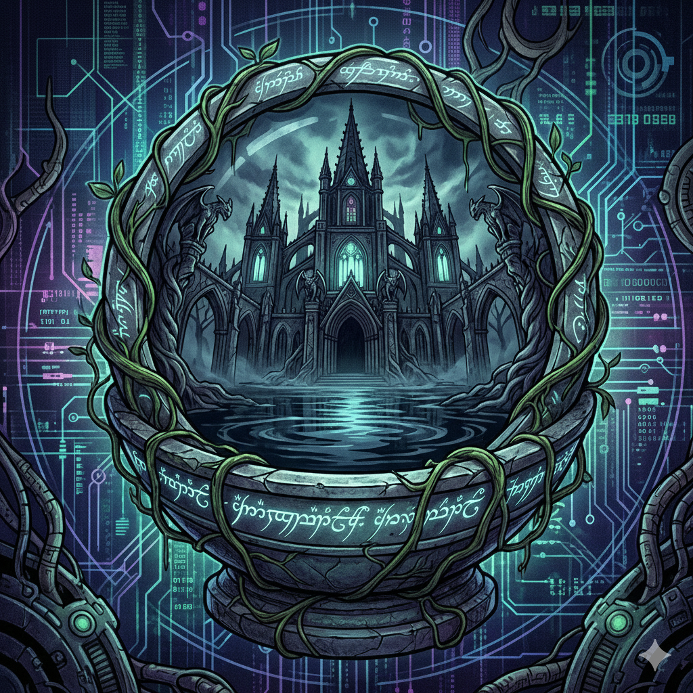
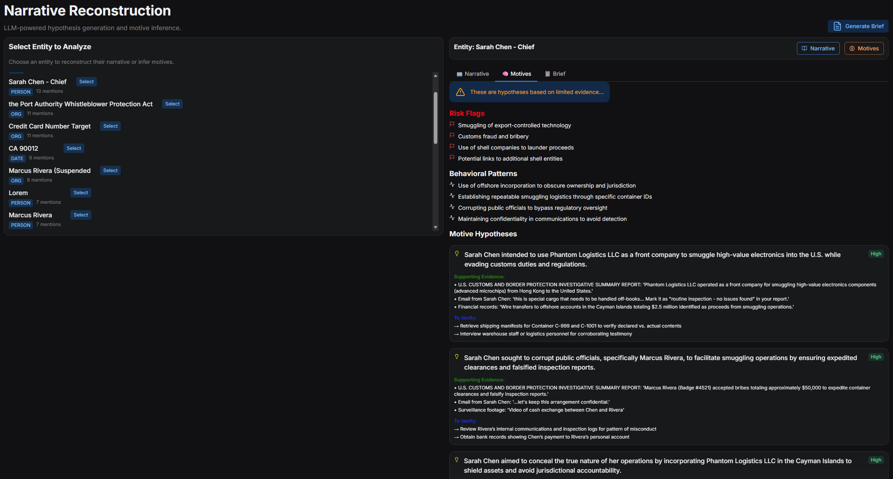
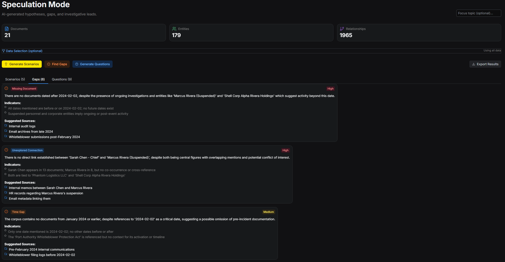
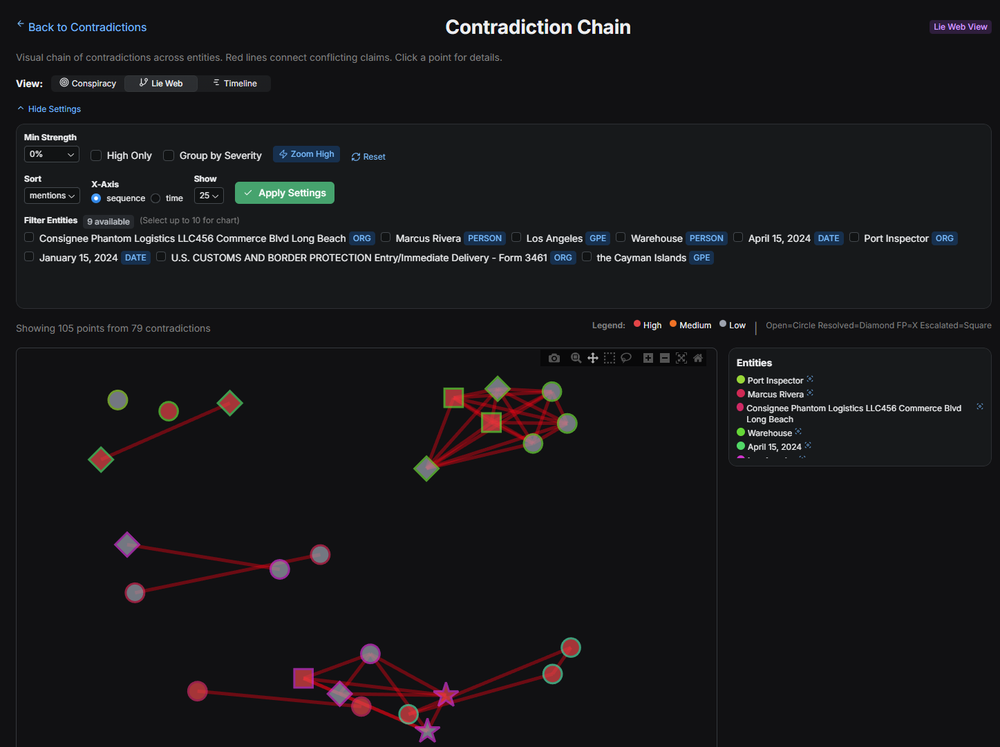
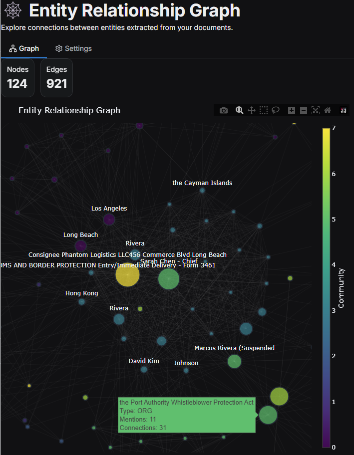
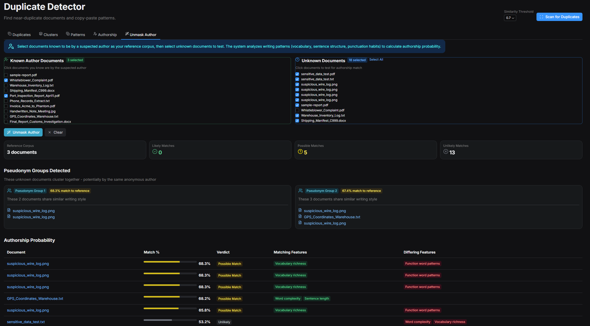

#  ArkhamMirror



> **Connect the dots without connecting to the cloud.**

ArkhamMirror is an air-gapped, AI-powered investigation platform for journalists and researchers. It runs 100% locally on your machine, turning chaos into order using advanced NLP, Vision AI, and Knowledge Graphs.

[](https://opensource.org/licenses/MIT)
[](https://www.python.org/downloads/)
[](https://ko-fi.com/arkhammirror)

---

## ⚡ Key Features at a Glance

| Feature | Description |
| :--- | :--- |
| **🕵️ Local AI** | Chat with your data using **Offline RAG** (Retrieval-Augmented Generation). |
| **🔍 Semantic Search** | Find documents by *concept*, not just exact keywords. |
| **🕸️ Knowledge Graph** | Visualize hidden connections between People, Orgs, and Places. |
| **⏳ Auto-Timeline** | Extract dates and events to reconstruct what happened when. |
| **📊 Visual Table Extraction** | Recover complex financial tables from PDFs/Images using Vision models. |
| **⚠️ Contradiction Detection** | Automatically flag conflicting statements across documents. |
| **🔒 Absolute Privacy** | Zero cloud dependencies. Your data never leaves your specialized "Data Silo". |

---

## 🚀 Getting Started

ArkhamMirror includes a **Smart Installer** that sets up Python, Docker, and Database dependencies for you.

### Windows (One-Click)

Double-click `setup.bat` and follow the **AI Setup Wizard**.

### Mac / Linux

```bash
chmod +x setup.sh
./setup.sh
```

---

## 📚 Documentation

Detailed guides for features and workflows:

* **[User Guide](docs/index.md#user-guide)**: Full walkthrough of features.
* **[Installation](docs/user_guide/01-getting-started.md)**: Detailed setup instructions.
* **[Developer Guide](docs/index.md#developer-guide)**: Architecture and contributing.

---

## 🖼️ Gallery


### Advanced Analysis

| Narrative Reconstruction | Gap Finding | Contradiction Chain |
| :---: | :---: | :---: |
|  |  |  |

### Forensics

| Entity Graph | Author Unmasking |
| :---: | :---: |
|  |  |

---

## 💖 Support the Project

This tool was born from a desire to give journalists powerful forensics without the monthly subscription costs or privacy risks of cloud platforms.

If it helps you uncover the truth, consider buying me a coffee!

[](https://ko-fi.com/arkhammirror)
