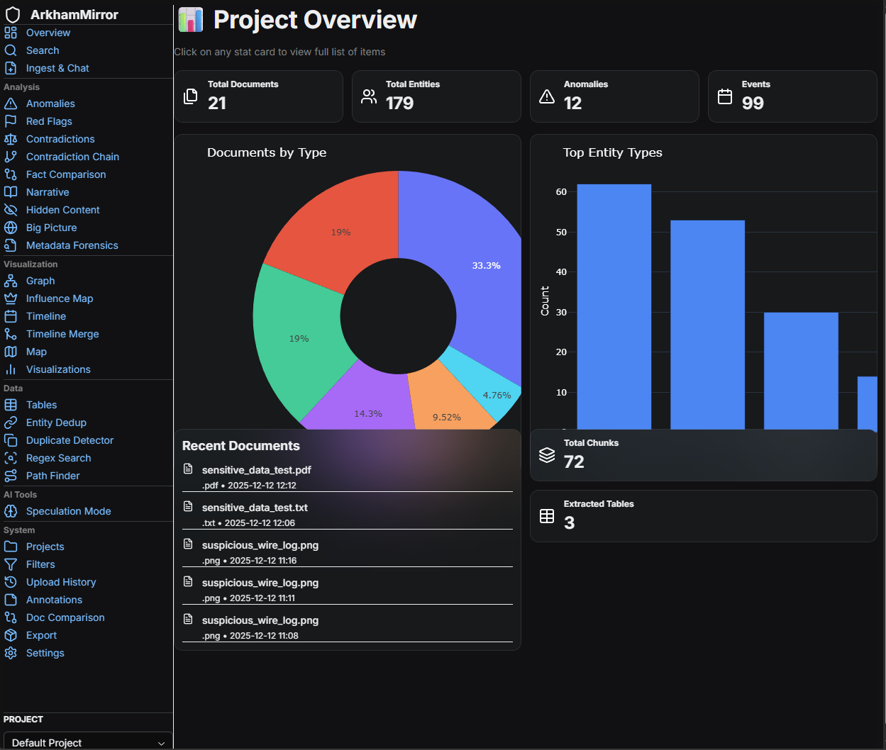
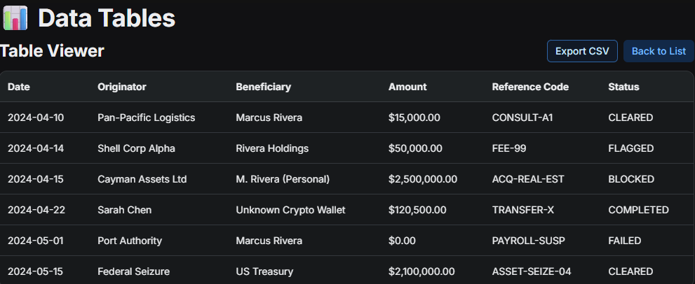

# Ingestion & Organization

The first step in any investigation is getting your documents into the system.

## 📂 Project Management

ArkhamMirror organizes your work into **Projects**.

* **Create a Project**: Give it a clear name (e.g., "City Hall Corruption 2024").
* **Isolation**: Documents in one project usually don't affect others, keeping your investigations clean.

## 📥 supported Formats

ArkhamMirror's ingestion engine automagically handles:

* **PDFs**: Scanned or digital.
* **Images**: JPG, PNG, TIFF (automatically OCR'd).
* **Office Docs**: DOCX, PPTX (converted to PDF).
* **Emails**: EML, MSG (text and attachments extracted).
* **Text**: TXT, MD, LOG.

## ⚙️ The Ingestion Process

1. Navigate to the **Ingest** page.
2. **Drag & Drop** files onto the upload zone.
3. Click **Start Processing**.

### What happens behind the scenes?

1. **Format Normalization**: Everything becomes a searchable PDF/Text standard.
2. **Hybrid OCR**:
    * **Fast Path**: Clear text is extracted instantly.
    * **Smart Path**: Handwriting and complex tables are sent to Qwen-VL (if enabled) or PaddleOCR.
3. **Entity Extraction**: Spacy scans for People, Organizations, and Locations.
4. **Vector Embedding**: Text is converted to math vectors for Semantic Search.

## 📊 Table Extraction

For documents with heavy financial data, check the **Tables** tab.
ArkhamMirror uses Vision AI to reconstruct complex tables into CSV-ready formats, preserving row/column relationships that standard OCR often breaks.
