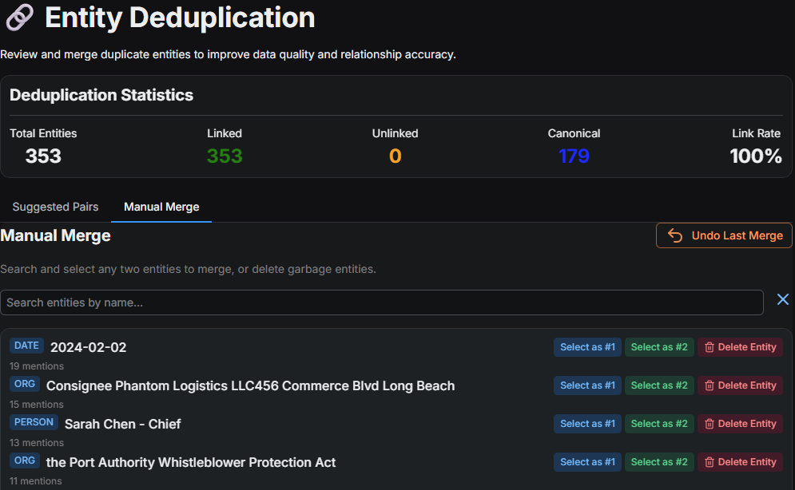
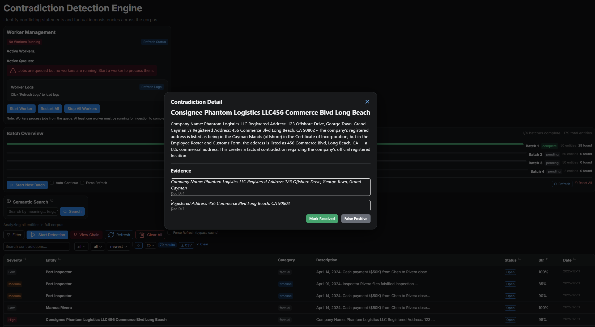

# Analysis Tools

Once documents are ingested, the real work begins.

## 🔎 Semantic Search

Forget `Ctrl+F`. Semantic Search understands *meaning*.

* Searching for **"bribe"** will find "illicit payment", "kickback", and "envelope of cash".
* Results are ranked by relevance score (0-100%).

## 🧩 Entity Resolution

Real documents are messy. You'll see "Robert Smith", "Bob Smith", and "R. Smith".

* Go to the **Entity Dedup** page.
* The AI suggests probable duplicates.
* **Merge** them to unify their connections in the Knowledge Graph.

## ⚠️ Contradiction Detection

One of ArkhamMirror's most powerful features.

1. Select a set of entities.
2. The AI analyzes every statement made about them across all documents.
3. It flags **direct contradictions** (e.g., Doc A says "He was in London", Doc B says "He was in New York").

## 🔮 Speculation Mode

Stuck? Let the AI think like a detective.

* **Gap Analysis**: "What dates are missing from this timeline?"
* **Hypothesis Generation**: "Based on these emails, what might the motive be?"
* **Question Generation**: "Who should I interview next?"

> **Note**: This feature requires a local LLM connection (LM Studio).

## 🔢 Regex & PII Search

Instantly scan thousands of pages for sensitive data:

* Social Security Numbers
* Credit Card Numbers
* Email Addresses
* Phone Numbers

Confirm findings and export a "Sensitive Data Report" for redaction.
