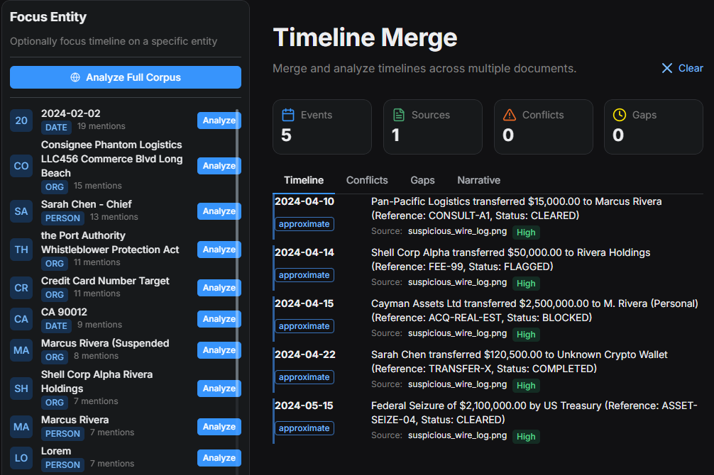

# Visualizations

ArkhamMirror turns text into visual insights.

## 🕸️ Knowledge Graph

See the hidden network.

* **Nodes** are People, Organizations, or Locations.
* **Edges** (lines) are relationships found in the text.
* **Influence Mapping**: Bigger nodes represent "central" figures who connect disparate groups.

## ⏳ Interactive Timeline

The system automatically extracts dates and associated events.

* **Heatmap**: See spikes in activity (e.g., a flurry of emails right before a scandal breaks).
* **Narrative**: An AI-generated summary of the sequence of events.

## 🗺️ Geospatial Map

Any location found in documents is geocoded and plotted.

* Click a pin to see exactly what happened there.
* Ideal for tracking movement of goods or people.
